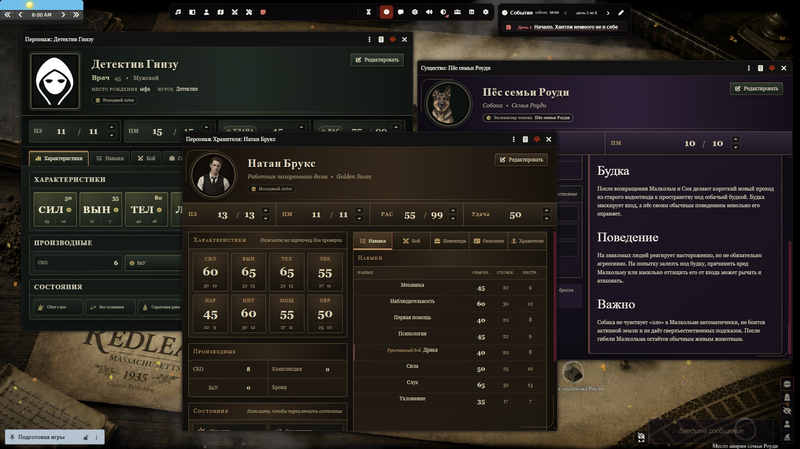

# Ginzzzu's CoC7 Sheets

**English** | [Русский](README_RU.md)

[](https://github.com/Ginzzzu/ginzzzu-coc7-sheets/releases)


Modern alternative character sheets for **Call of Cthulhu 7th Edition** on **Foundry VTT v14**.

Ginzzzu's CoC7 Sheets provides dedicated opt-in sheets for investigators, Keeper NPCs, creatures, and locations while keeping gameplay data in the native CoC7 Actor and Item fields.

<p align="center">
  
</p>

The module does **not** replace the standard CoC7 sheets automatically. Each alternative sheet can be selected through Foundry's Actor sheet configuration.

---

## Download & Installation

### Install through Foundry VTT

Open:

**Add-on Modules → Install Module**

and paste the following Manifest URL:

```text
https://github.com/Ginzzzu/ginzzzu-coc7-sheets/releases/latest/download/module.json
```

### Download Latest Release

**[Download Ginzzzu's CoC7 Sheets](https://github.com/Ginzzzu/ginzzzu-coc7-sheets/releases/latest/download/ginzzzu-coc7-sheets.zip)**

### Manual Installation

1. Download the latest ZIP archive.
2. Extract it into your Foundry VTT modules directory:

```text
FoundryVTT/Data/modules/ginzzzu-coc7-sheets
```

3. Restart Foundry VTT.
4. Open a world using the Call of Cthulhu 7th Edition system.
5. Enable **Ginzzzu's CoC7 Sheets** in **Manage Modules**.
6. Open an Actor's sheet configuration and select the desired Ginzzzu sheet.

---

## Main Features

### Investigator Sheet

A modern investigator sheet built around native CoC7 data and roll workflows.

The investigator sheet includes:

- portrait and investigator identity;
- all eight characteristics with native CoC7 checks;
- Hit Points, Magic Points, Luck, Sanity, MOV, Build, Damage Bonus, and Armor;
- native CoC7 conditions;
- Skills with live search and useful filters;
- Combat with weapon attacks, linked skill checks, damage rolls, and ammunition tracking;
- Possessions and monetary assets;
- Biography using native CoC7 backstory and biography fields;
- Character Development using native marked skills and CoC7 development methods;
- Keeper-only investigator information and Sanity controls;
- Russian and English localization.

The sheet supports normal play and an explicit edit mode while preserving native CoC7 Actor data.

### Skills

The Skills workspace provides:

- live skill search;
- All, Occupation, Combat, and Marked filters;
- native CoC7 skill checks;
- regular, hard, and extreme values;
- character-creation point allocation where supported by the system.

### Combat

Investigator and Keeper-facing combat views provide direct access to the actions needed during play, including:

- weapon attacks;
- linked weapon skill checks;
- direct damage rolls;
- full or half Damage Bonus where appropriate;
- ranged ammunition display and editing;
- native CoC7 ammunition synchronization after ranged attacks.

Damage-only rolls do not automatically apply damage to targets.

### Possessions & Finances

The investigator sheet includes:

- grouped possessions;
- native embedded Item access;
- monetary assets;
- possession notes and financial information stored in the native CoC7 Actor fields.

### Biography

Biography content follows the native CoC7 backstory configuration.

Depending on the CoC7 system setting, the sheet supports:

- one-block backstory;
- section-based biography.

Rich-text content uses Foundry's native editor structure.

### Development

The Development workspace uses native CoC7 character-development mechanics.

It includes:

- marked skills;
- individual skill development;
- the full development phase;
- optional Luck development when enabled by CoC7;
- experience and character-creation point summaries.

### Keeper Investigator Data

GMs receive an additional Keeper-only workspace with native CoC7 information such as:

- Sanity and insanity controls;
- daily Sanity-loss information and reset;
- Sanity-loss encounters;
- Sanity-loss immunities;
- Mythos-related character features;
- Mythos book study progress;
- Keeper notes.

---

## Keeper NPC & Creature Sheets

The module includes a separate opt-in Keeper-facing sheet for **NPC** and **creature** Actors.

It provides:

- portrait and identity;
- characteristics and derived values;
- HP, MP, Sanity, and Luck where available;
- native CoC7 conditions;
- skills;
- combat;
- weapons and ammunition;
- inventory;
- public description;
- Keeper-only notes;
- native Item sheet access.

Creature sheets use their own visual treatment while retaining the same native CoC7 data model and roll workflows.

---

## Location Mode

NPC Actors whose native CoC7 type is **Location / Локация** automatically use the dedicated location layout.

A Keeper can also switch an editable NPC Actor into or out of location mode from the sheet.

Location mode provides a focused two-column layout:

- **Description** for public location information;
- **Keeper Notes** for GM-only information.

The mode is derived from native Actor data and does not require a separate module flag.

---

## Optional Player HUD Integration

If **Ginzzzu's CoC7 Player HUD** is installed and active, the investigator sheet can use its public investigator-creation API.

For the current player's assigned investigator, the sheet can show:

- **Start creation** for a conservatively detected blank investigator;
- **Continue creation** for an unfinished Player HUD creation draft;
- the current creation step.

Player HUD is completely optional and is **not** a required dependency of Ginzzzu's CoC7 Sheets.

The Sheets module does not duplicate Player HUD creation data into its own storage.

---

## Native CoC7 Data

Ginzzzu's CoC7 Sheets intentionally keeps gameplay data in the native CoC7 Actor and Item fields.

The module does not maintain parallel copies of investigator, NPC, creature, or location gameplay data in module flags.

This allows the alternative sheets to coexist with the standard CoC7 system sheets and workflows.

---

## Compatibility

| Component | Version |
|---|---|
| Foundry Virtual Tabletop | v14 |
| Verified Foundry build | 14.365 |
| Call of Cthulhu 7th Edition | 8.15+ |

The **CoC7** system is required.

---

## Community & Support

**Discord:**  
https://discord.gg/bHA7JhVUCX

**Boosty:**  
https://boosty.to/ginzzzu

**GitHub:**  
https://github.com/Ginzzzu/ginzzzu-coc7-sheets

---

## For Developers

The module registers alternative Actor sheets with Foundry and keeps them opt-in:

- `character` → investigator sheet;
- `npc` → Keeper NPC / location sheet;
- `creature` → Keeper creature sheet.

Neither sheet is made the default automatically.

Detailed implementation changes and version history are maintained in:

**[CHANGELOG.md](https://github.com/Ginzzzu/ginzzzu-coc7-sheets/blob/main/CHANGELOG.md)**

---

## License & Credits

Ginzzzu's CoC7 Sheets is open-source software.

Foundry Virtual Tabletop and Call of Cthulhu are the property of their respective owners.
